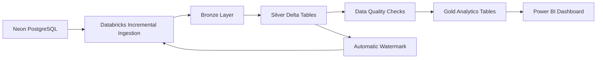
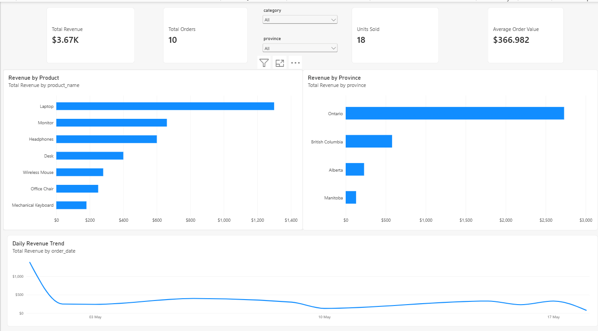
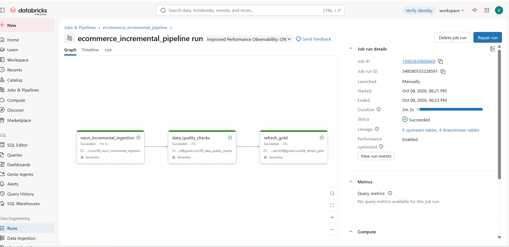
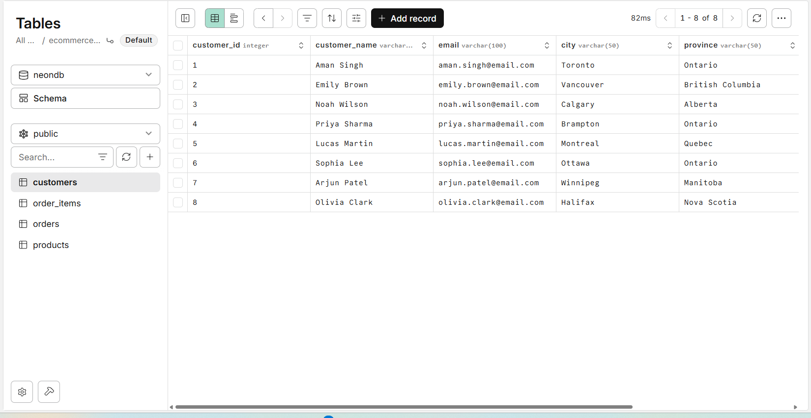

# End-to-End E-Commerce Data Engineering Pipeline

An end-to-end cloud data engineering project that ingests e-commerce transactional data from PostgreSQL, processes incremental data with Databricks and PySpark, applies data-quality checks, and serves analytics-ready data to Power BI.

## Architecture



## Technologies Used

- PostgreSQL
- Neon PostgreSQL
- Databricks
- Apache Spark / PySpark
- Delta Lake
- Python
- Databricks Jobs
- Power BI
- Git & GitHub

## Key Features

- Cloud PostgreSQL source
- Incremental ingestion
- Automatic watermarking
- Bronze-Silver-Gold architecture
- Delta Lake MERGE / upsert
- Data-quality validation
- Duplicate and null handling
- Databricks workflow orchestration
- Analytics-ready Gold tables
- Interactive Power BI dashboard

## Data Pipeline

The pipeline follows this flow:

Neon PostgreSQL → Incremental Ingestion → Bronze → Silver → Data Quality → Gold → Power BI

The incremental pipeline determines the maximum processed ID from the Silver tables and only retrieves newer records from PostgreSQL.

## Data Quality Checks

The pipeline validates:

- Null primary keys
- Duplicate IDs
- Invalid quantities
- Negative prices
- Invalid order statuses

If a validation fails, processing stops before the Gold layer is refreshed.

## Databricks Workflow

The automated Databricks Job executes:

1. Neon incremental ingestion
2. Data quality checks
3. Gold layer refresh

## Power BI Dashboard

The dashboard includes:

- Total Revenue
- Total Orders
- Units Sold
- Average Order Value
- Revenue by Product
- Revenue by Province
- Daily Revenue Trend
- Category and Province filters

## Screenshots

### Power BI Dashboard


### Databricks Pipeline


### Neon PostgreSQL Source


## Project Structure

```text
ecommerce-data-pipeline/
├── databricks/
├── docs/
│   └── screenshots/
├── ingestion/
├── .gitignore
├── README.md
└── requirements.txt
```

## Project Status

Completed end-to-end automated data engineering pipeline.
